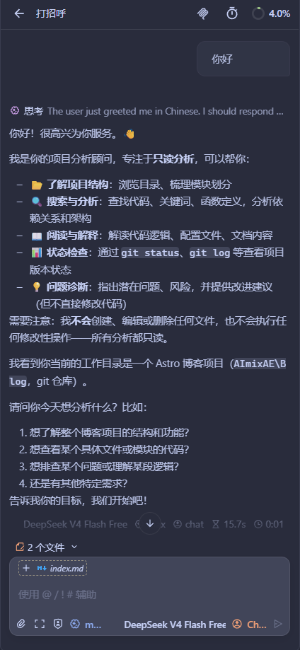

# 今日凌晨份插件推荐~

呜... 好晚... 我要推荐一个插件~

遇事不决，先推仓库 ⭐

::github{repo="openchamber/openchamber"}

## 介绍

正如 desc 介绍，OpenChamber 是 OpenCode 在 VSCode 上优秀的 GUI 插件。

它可以与你的 VSCode 集成，提供一个更方便的 OpenCode 界面。

## 示例图

怎么样，是不是有种受宠若惊的感觉 (。・ω・。)

该插件的自定义性也十分的强大！你可以很自由的配置 OpenCode。

当然，它还是有一点点的不足，比如它的字体设置不能选择自定义的字体
，所以文字就没有办法选择自己喜欢的了呢...

> [!NOTE] 碎碎念 _(2026-08-14 00 : 04)_
> 诶，我怎么提前把空白的页面提交上去了呢.. 还真是个小错误
