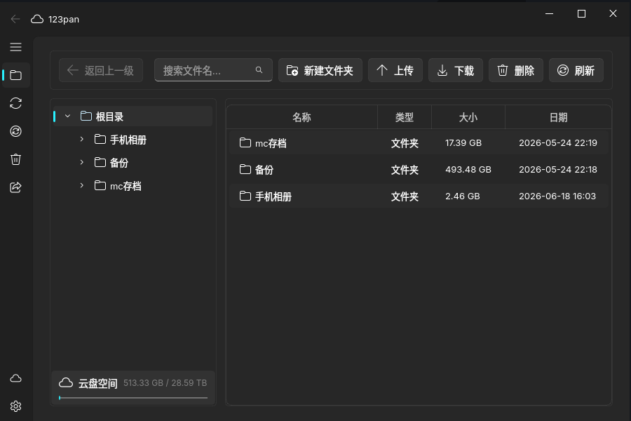
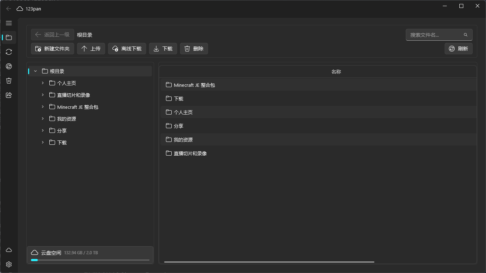

# 今日份项目推荐~

先把新鲜的项目贴出来~

::github{repo="123panNextGen/123pan"}

## 介绍

> [!NOTE] 提醒
> 这个项目是123pan的第三方客户端，并不是官方哦~
>
> 但效果可能比官方稍好一点叭 §(*￣▽￣*)§

这个项目采用了 **Fluent UI** 的设计风格，拥有着比官方的electron客户端更好体验呢~

并且，这个项目还可以**突破流量限制** _(只不过是部分罢了)_

以下是项目的核心介绍:

- 🚀 破解部分流量限制（模拟安卓协议，突破官方 PC 端每日 1GB 自用流量限制，下载限流（429/5xx）指数退避重试）
- 🔄 文件夹同步（本地 ↔ 云端）+ 系统托盘后台运行
- ⚡ 多线程分片下载 + 断点续传
- 📤 分片上传 + 断点续传（支持秒传），支持文件夹上传与上传前校验
- 📥 离线下载（HTTP / HTTPS / Magnet / 迅雷链接，服务器后台下载）
- ⚡ 秒传导入 / 导出（兼容 123FastLink、夸克 / 天翼等网盘秒传数据）
- 🎛️ 上传/下载限速、暂停、取消，线程数可自定义
- 📊 实时速度 & 进度显示
- 🔐 密码登录 + 123 云盘 App 扫码登录
- 👁️ 文件预览（图片/文本/PDF/音频/视频）
- 🔗 分享链接管理（免费/付费）
- 🗑️ 回收站管理
- 👤 多账号切换 + 设备伪装
- 🌐 中英文多语言支持
- 🌗 深浅色主题（跟随系统 / 浅色 / 深色，可手动切换）

该项目采用 Python 编写，所以也有着良好的跨平台支持呢~

该项目主要贡献者主要有以下几位:

- [xhdndmm](https://github.com/xhdndmm): 主要贡献者，最活跃的开发者
- [AImixAE](https://github.com/AImixAE): 主要贡献者，3.0 版本主要开发者 _(自豪.jpg)_
- [Z9CR](https://github.com/Z9CR): 贡献者
- [Qxyz17](https://github.com/Qxyz17): 组织Owner，想法开辟者

顺便放几张宣传图~

如果好看的话，请为这个项目点个 ⭐Star 吧!
